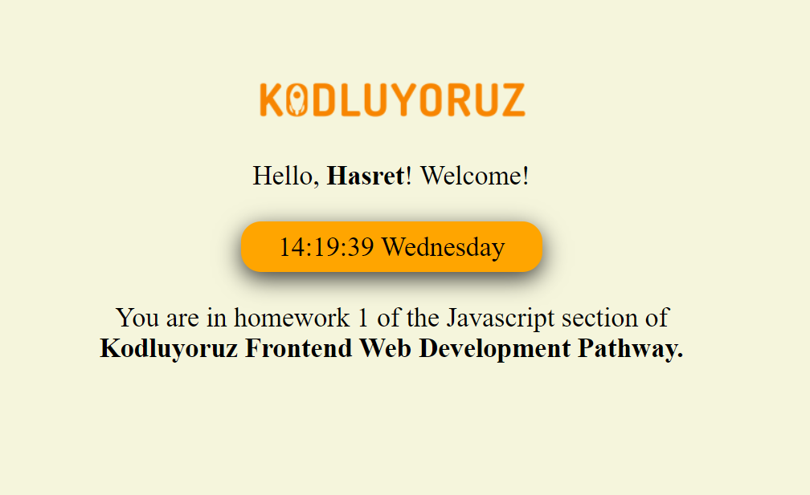

# Greeting and Watch
### Iyzico Front-end Practicum JavaScript Homework 1

- Getting information from the user
- Printing the time and day on the screen
- Continuous updating of the second display of the watch

The screenshot of the project is as follows.
